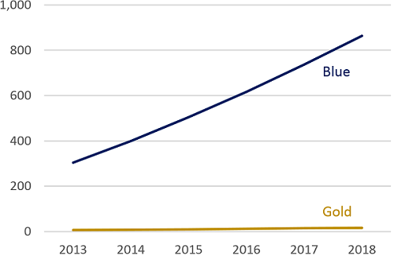
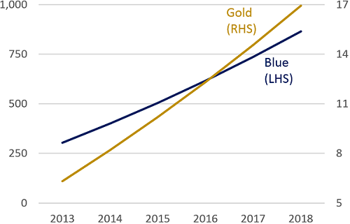
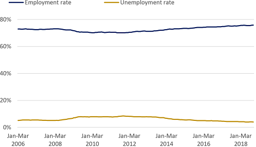
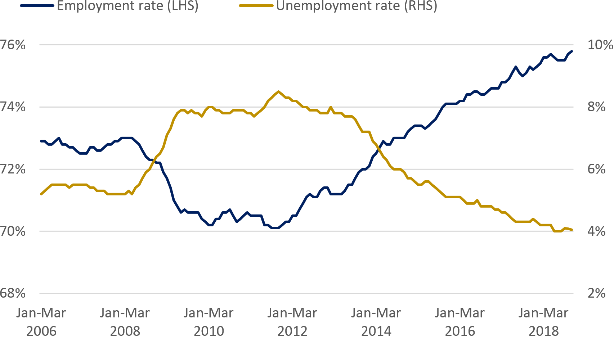
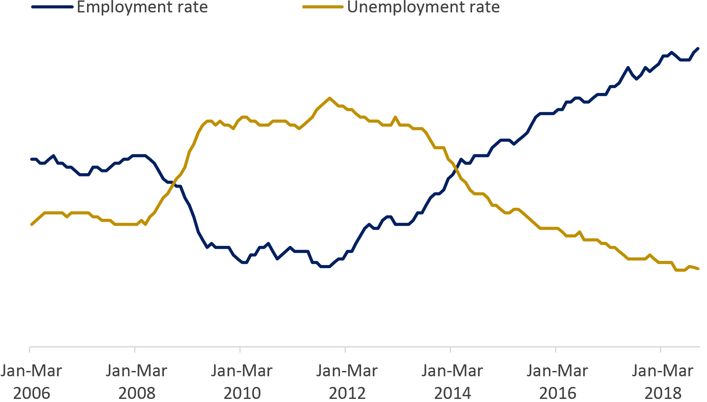
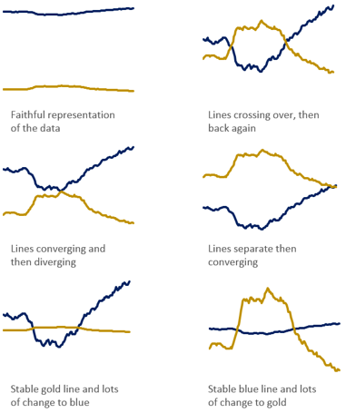

###### 16th February 2026
###### Author: Frank Donnarumma

## Dueling with axis: the problems with dual axis charts

Charts with two different y-axis are often used in the reporting of statistics. They can display two or more related variables together that may use different units, or where one series is orders of magnitude higher or lower than another. But dual axis charts come with a host of problems that make them confusing, and even misleading.

It’s important to remember that saying something with a chart is not so different to saying it in text – we’re just using a different vocabulary. We would see it as a glaring mistake to say “10 is bigger than 100” in writing, yet with dual axis charts we often say this visually. It should set the same alarm bells ringing in our minds.

Take the following chart. “Gold” has a small amount of growth, but it’s tricky to see. We decided that we need to show “Gold” more effectively despite the tiny change relative to “Blue”.

{width=500px}

We often resort to dual axis charts to bring out both of these messages. Here’s a reworked version done in a way we often see applied in statistical publications.

{width=500px}

By putting several lines or bars on the same canvas we are inviting the user to make comparisons – as they might intuitively do with a regular line chart. Consider the following statements about our Blue compared with Gold dual axis chart:

“Gold grew faster than Blue”
“Gold started lower than Blue in 2013, but was higher in 2018”
“Gold overtook Blue around 2016”
They are all incorrect, but can we blame a less statistically literate user, or even an expert short on time for making them? After all, without studying the axis, the visual elements of the chart do suggest these to be true.

Now let’s break down a real life example.

The following chart suffers from a similar problem as our first chart. Both lines are very different in magnitude, but both exhibit subtle and important trends we need to describe. Again, the chart is a very faithful representation of the data, but just looks like two, broadly flat lines. It’s fairly uninspiring.

{width=500px}
{width=500px}
{width=500px}
{width=500px}