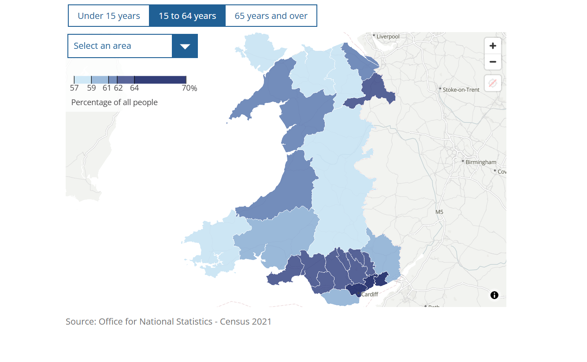
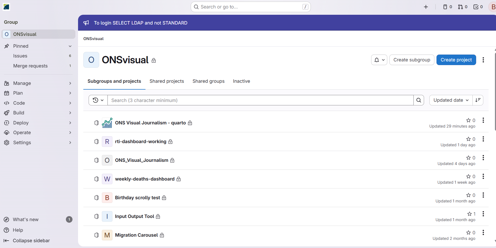
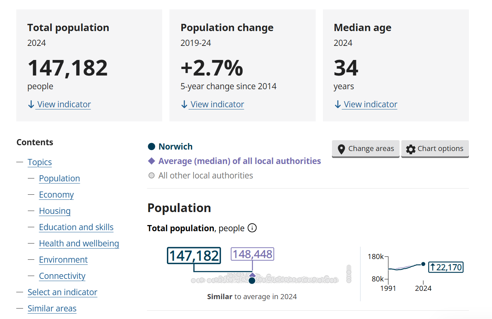
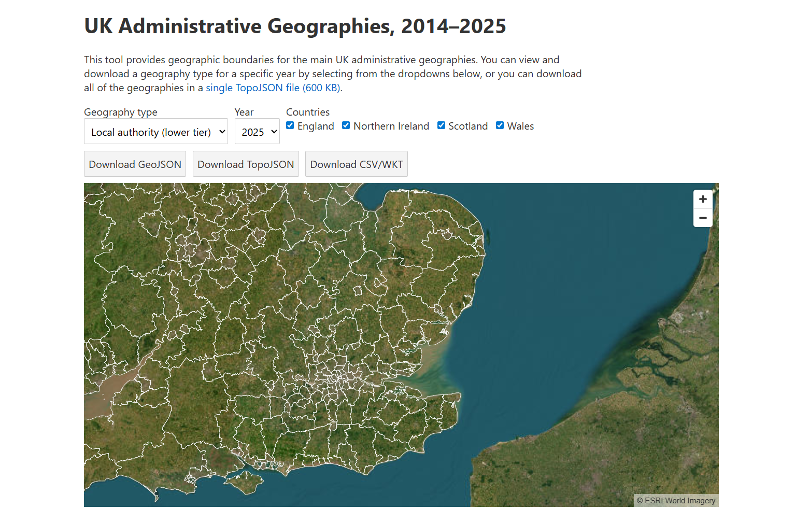
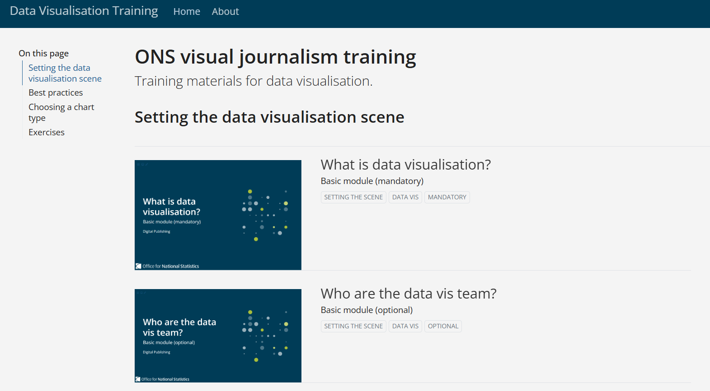

For consultancy/advice - [contact us](mailto: digitalcontent@ons.gov.uk)

::: {.grid}

::: {.g-col-12 .g-col-md-4}
<a href="https://github.com/ONSvisual/Charts" class="text-decoration-none">

<h4 class="card-title">Charts</h4>

Subtitle about charts

</a>

:::

::: {.g-col-12 .g-col-md-4}
<a href="https://github.com/ONSdigital/maptemplates" class="text-decoration-none">

<h4 class="card-title">Map templates</h4>

Subtitle about map templates

</a>

:::

::: {.g-col-12 .g-col-md-4}
<a href="https://gitlab-app-l-01/ONSvisual" class='text-decoration-none'>

<h4 class="card-title">ONSvisual</h4>

Subtitle about ONSvisual

</a>

:::

::: {.g-col-12 .g-col-md-4}

<a href="https://service-manual.ons.gov.uk/data-visualisation" class="text-decoration-none">

<h4 class="card-title">Service manual</h4>

Subtitle about service manual

</a>

:::

::: {.g-col-12 .g-col-md-4}

<a href="https://www.ons.gov.uk/explore-local-statistics/" class="text-decoration-none">

<h4 class="card-title">Explore Local Statistics</h4>

Subtitle about ELS

</a>

:::

::: {.g-col-12 .g-col-md-4}

<a href="https://onsdigital.github.io/uk-topojson/" class="text-decoration-none">

<h4 class="card-title">UK Administrative Geographies</h4>

Subtitle about tool for downloading UK geographies 2014–2025

</a>

:::

::: {.g-col-12 .g-col-md-4}

<a href="https://github.com/ONSdigital/data-vis-training" class="text-decoration-none">

<h4 class="card-title">Training</h4>

A code library of helpful snippets

</a>

:::

::: {.g-col-12 .g-col-md-4}
<a href="https://officenationalstatistics.sharepoint.com/sites/digpub/DigPub/Forms/AllItems.aspx?id=%2Fsites%2Fdigpub%2FDigPub%2FPICI%2FImprove%20%2D%20Data%20vis%2FData%20vis%20training%2FONS%20charts%20cheat%20sheet%20%2D%20Nov%202025%2Epdf&parent=%2Fsites%2Fdigpub%2FDigPub%2FPICI%2FImprove%20%2D%20Data%20vis%2FData%20vis%20training"  class="text-decoration-none">

<h4 class="card-title">ONS Charts cheat sheet</h4>

Subtitle about cheat sheet

</a>

:::

:::

You can contact us at [digitalcontent@ons.gov.uk](mailto:digitalcontent@ons.gov.uk) and we will set up a consultation to see how we can best support you.

