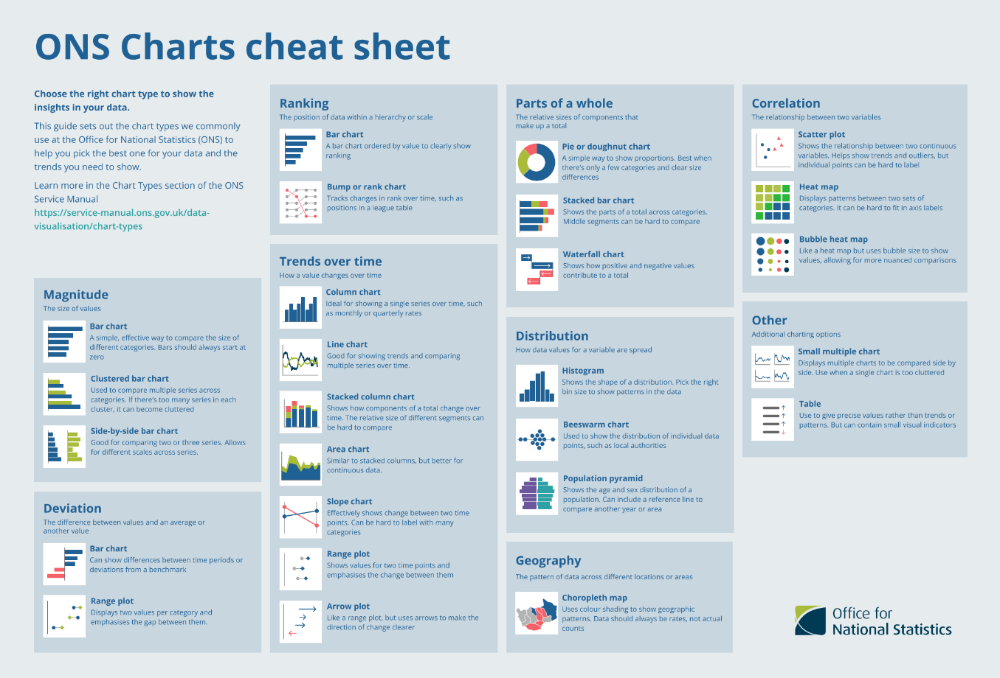
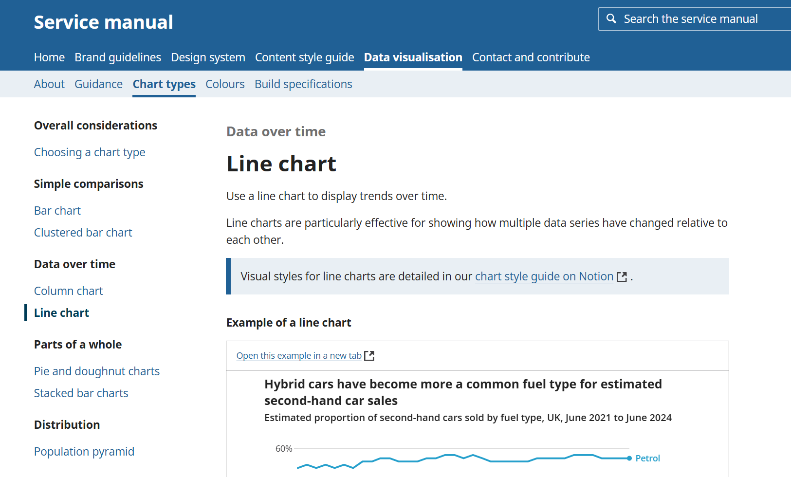
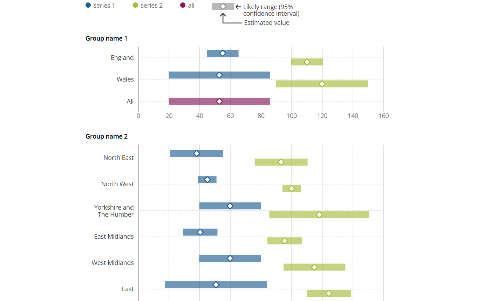

::: {.grid}

::: {.g-col-12 .g-col-md-4}
<a href="https://officenationalstatistics.sharepoint.com/sites/digpub/DigPub/Forms/AllItems.aspx?id=%2Fsites%2Fdigpub%2FDigPub%2FPICI%2FImprove%20%2D%20Data%20vis%2FData%20vis%20training%2FONS%20charts%20cheat%20sheet%20%2D%20Nov%202025%2Epdf&parent=%2Fsites%2Fdigpub%2FDigPub%2FPICI%2FImprove%20%2D%20Data%20vis%2FData%20vis%20training"  class="text-decoration-none">

<h4 class="card-title">ONS Charts cheat sheet</h4>

Choose the right chart type to show the 
insights in your data.

</a>

:::

::: {.g-col-12 .g-col-md-4}

<a href="https://service-manual.ons.gov.uk/data-visualisation" class="text-decoration-none">

<h4 class="card-title">Service manual</h4>

Guidance for creating charts and tables and best practice for using colour in your work.

</a>

:::

::: {.g-col-12 .g-col-md-4}
<a href="https://github.com/ONSvisual/Charts" class="text-decoration-none">

<h4 class="card-title">Charts</h4>

ONS chart components

</a>

:::

:::

You can contact us at [digitalcontent@ons.gov.uk](mailto:digitalcontent@ons.gov.uk) and we will set up a consultation to see how we can best support you.
