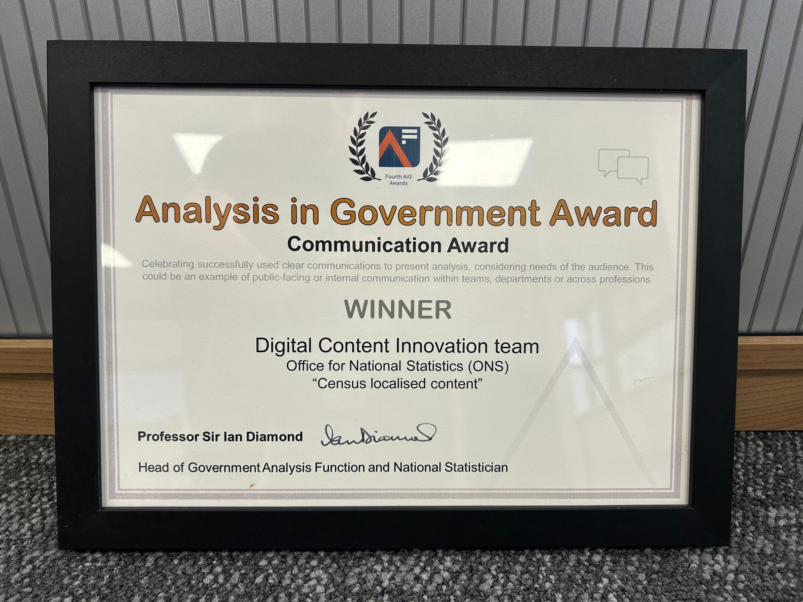
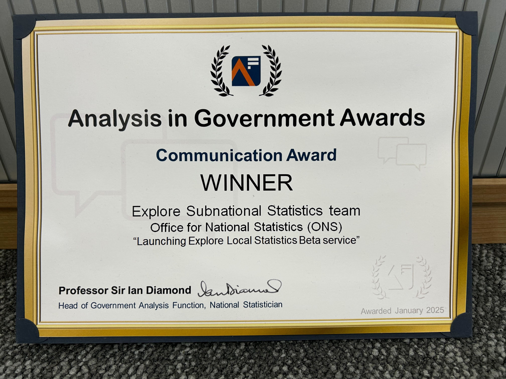
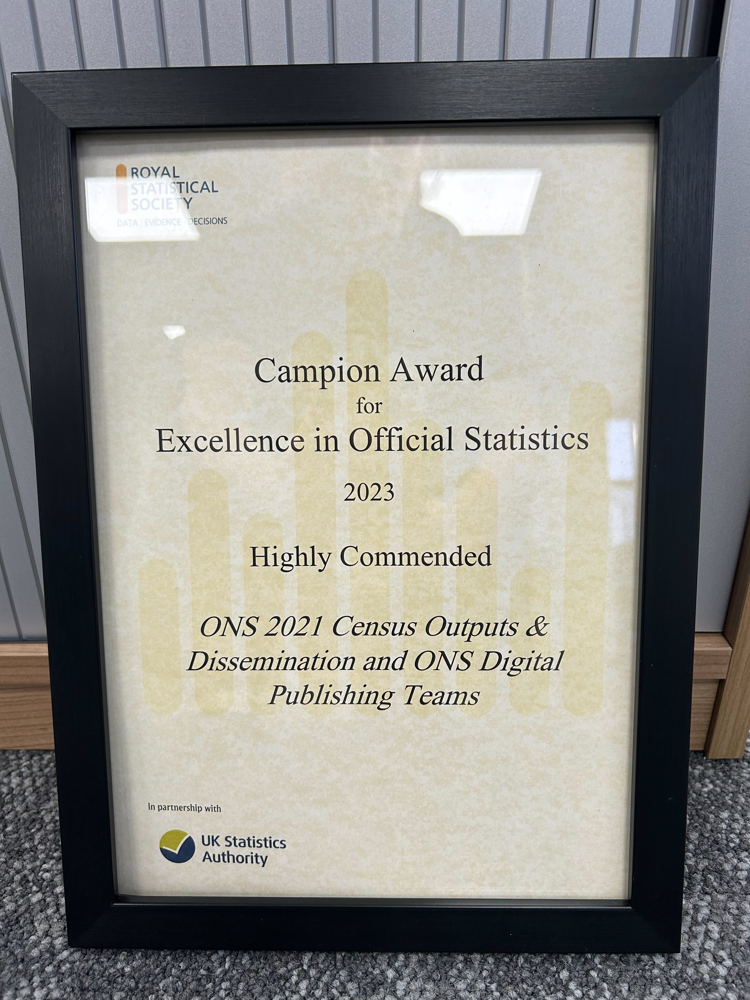

Our team focuses on improving the understanding and engagement with ONS analysis. We offer a range of services in data visualisation, journalism, graphic design, content design and social media.

## Awards

::: {.grid}

::: {.g-col-12 .g-col-md-3}
<a href="https://analysisfunction.civilservice.gov.uk/news_categories/analysis-in-government-awards/" class="text-decoration-none">

<h4 class="card-title">Analysis in Government Award</h4>

Census localised content

</a>

:::

::: {.g-col-12 .g-col-md-3}
<a href="https://analysisfunction.civilservice.gov.uk/news_categories/analysis-in-government-awards/" class="text-decoration-none">

<h4 class="card-title">Analysis in Government Award</h4>

Launching Explore Local Statistics Beta service

</a>

:::

::: {.g-col-12 .g-col-md-3}
<a href="https://rss.org.uk/training-events/events/excellence-awards/campion-award-for-excellence-in-official-statistic/" class="text-decoration-none">

<h4 class="card-title">Campion Award</h4>

ONS 2021 Census Outputs & Dissemination and ONS Digital Publishing Team

</a>

:::

:::

You can contact us at [digitalcontent@ons.gov.uk](mailto:digitalcontent@ons.gov.uk) and we will set up a consultation to see how we can best support you.

